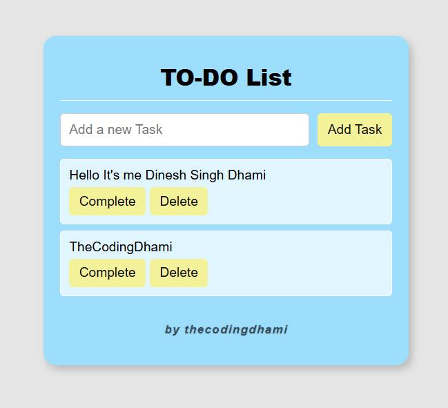

# TO-DO List App

A simple, responsive, and interactive **To-Do List web application** built with HTML, CSS, and JavaScript. The app includes features like marking tasks as complete, deleting tasks.

**Project by:** **thecodingdhami**

---

## Live Demo

Check the working app here: [Click Here](https://thecodingdhami.github.io/To-Do-List-App/) 

---

## Screenshots

**Desktop View:**  

---

## Features

- **Add Tasks:** Quickly add new tasks to your list.  
- **Delete Tasks:** Remove tasks individually with a smooth fade-out animation.  
- **Mark as Complete / Undo:** Mark tasks as completed, or undo completion. Completed tasks show with a strikethrough and subtle background.  
- **Persistent Storage:** Tasks are saved in `localStorage`, so they persist even after page refresh.  
- **Responsive Design:** Works on desktops, tablets, and mobile devices. Input, buttons, and task list adapt for small screens.  
- **Animations:** Smooth fade-in when adding tasks and fade-out when deleting tasks.  

---

## Installation

1. **Clone the repository:**
   ```bash
   git clone https://github.com/thecodingdhami/todo-list.git
   ```

2. **Open `index.html` in your browser**:
   - No server is required; the app runs entirely in the browser.  

---

## Usage

1. Type a task in the input field.  
2. Press **Enter** or click **Add Task**.  
3. Click **Complete** to mark it as done or **Undo** to unmark.  
4. Click **Delete** to remove a task.  
5. Your tasks are saved automatically and will remain after refreshing the page.  

---

## Technologies Used

- **HTML5**  
- **CSS3** (Responsive and mobile-friendly)  
- **JavaScript** (DOM manipulation, `localStorage`)  

---

## Folder Structure

```
todo-list/
│
├─ index.html
├─ style.css
├─ script.js
└─ README.md
```

---

## How to Contribute

1. **Fork the repository**  
2. **Clone your fork**:
   ```bash
   git clone https://github.com/your-username/todo-list.git
   ```
3. **Create a new branch** for your feature/fix:
   ```bash
   git checkout -b feature-name
   ```
4. **Make your changes** and commit them:
   ```bash
   git commit -m "Add new feature/fix description"
   ```
5. **Push to your branch**:
   ```bash
   git push origin feature-name
   ```
6. **Open a Pull Request** on the original repository.  

---

## Future Enhancements

- **Task Categories/Labels:** Group tasks by categories (e.g., Work, Personal).  
- **Dark Mode:** Add a toggle for light/dark themes.  
- **Drag-and-Drop:** Reorder tasks using drag-and-drop functionality.  
- **Due Dates & Reminders:** Set deadlines and browser notifications.  
- **Search & Filter:** Search tasks and filter by completed/pending.  
- **Progress Tracking:** Show a progress bar for completed tasks.  

---

## License

This project is **open source** and free to use under the [MIT License](LICENSE).

